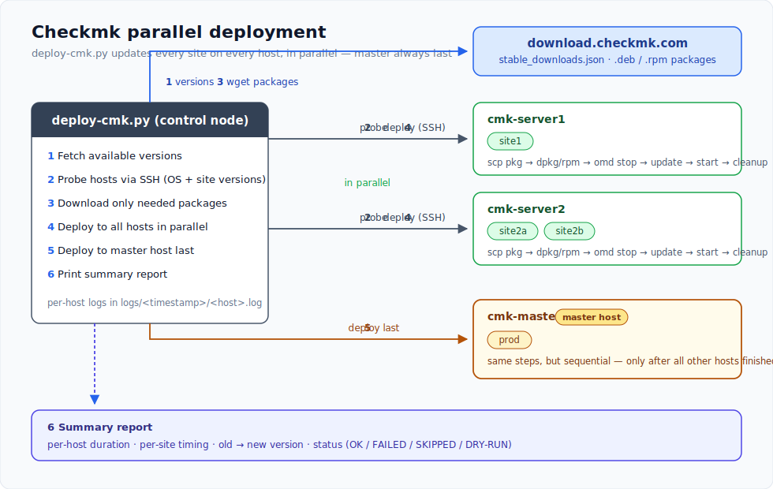

# Checkmk Update Deployment Script

Automated parallel deployment of Checkmk updates across multiple hosts.



## Features

- Auto-detects the latest stable version per major release from download.checkmk.com
- Detects OS on each host (Ubuntu, Debian, RHEL/CentOS/Rocky, SLES) and downloads the correct package
- Updates each site within its own major version (e.g. 2.4.0 sites get 2.4.0 updates, 2.5.0 sites get 2.5.0 updates)
- Supports multiple sites per host
- Deploys to all hosts in parallel, the central site host is always updated last
- Live output with `[hostname]` prefix during deployment
- Per-host log files with timestamps
- Dry-run mode to preview changes
- Cleans up old packages and unused Checkmk versions
- Summary report at the end showing per-host/site timing and final state

## Setup

1. Create credentials file:

```
cp hosts.json.template hosts.json
```

Edit `hosts.json` with your hosts and sites:

```json
{
    "hosts": {
        "cmk-server1": ["site1"],
        "cmk-server2": ["site2a", "site2b"]
    },
    "central": {
        "host": "cmk-central",
        "sites": ["prod"]
    }
}
```

2. Create `.pass` file with download credentials:

```
username
password
```

## Usage

Preview what would be updated:

```
./deploy-cmk.py --dry-run
```

Run the deployment:

```
./deploy-cmk.py
```

## How it works

1. Fetches available versions from `download.checkmk.com/stable_downloads.json`
2. Connects to all hosts in parallel to detect OS and current site versions
3. Downloads only the needed packages (per OS and major version)
4. Deploys to all regular hosts in parallel:
   - Copies package via scp
   - Installs package (dpkg/rpm)
   - For each site: stop, update, start
   - Runs `omd cleanup` to remove unused versions
5. Deploys to the central site host last (same steps, but sequential)
6. Prints a summary report with per-host duration, per-site timing, version changes, and status (OK/FAILED/SKIPPED)

## Logs

Each run creates a timestamped directory under `logs/` with one log file per host:

```
logs/20260414-153000/cmk-server1.log
logs/20260414-153000/cmk-server2.log
```
